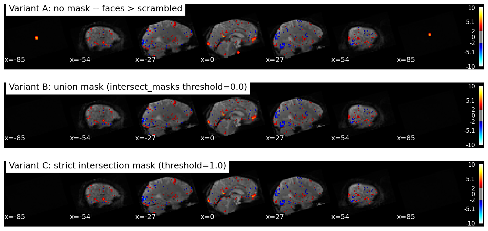
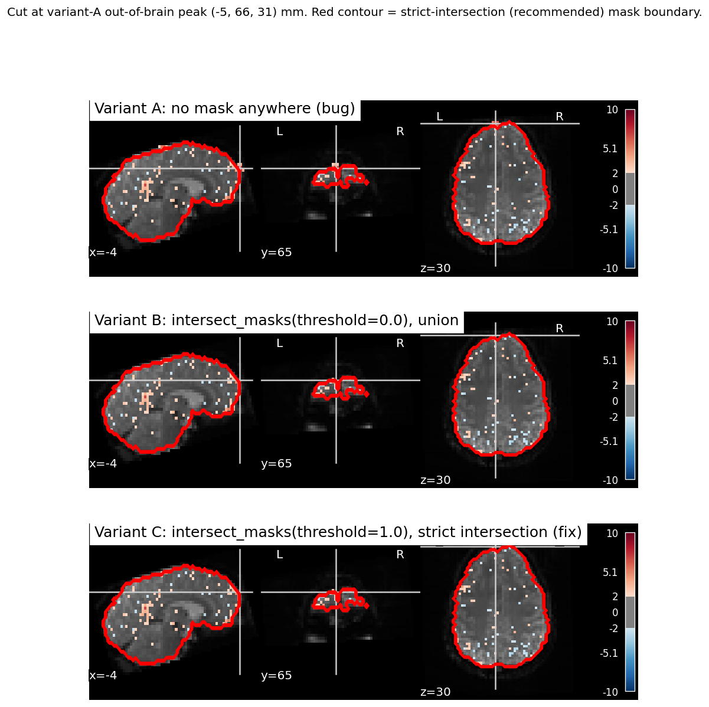
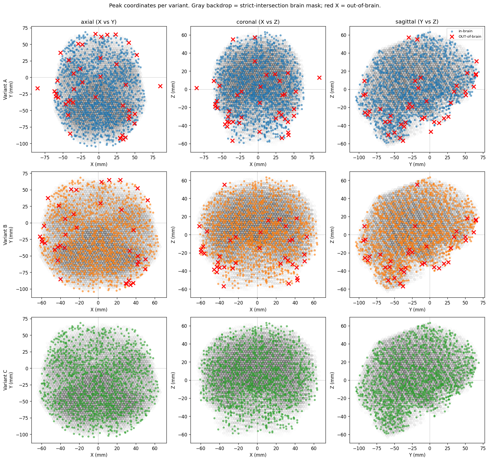
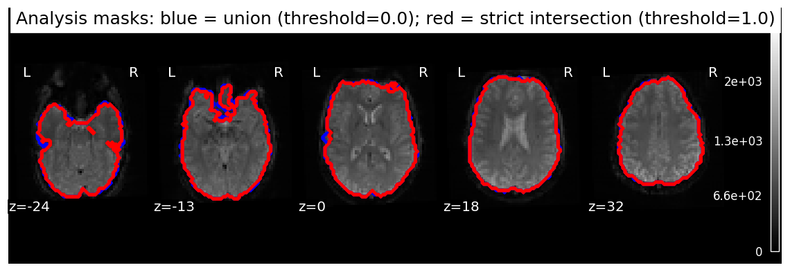

# nilearn_out_of_brain_peaks_demo

## The issue

`nilearn.reporting.get_clusters_table` does not accept a `mask_img` argument. It scans the entire 3-D image bounding box of whatever t-map you give it and reports peaks at every supra-threshold local maximum — including voxels outside the brain. The bug exists for any pipeline that doesn't mask the t-map before peak extraction. Multi-band acquisitions make it dramatic by depositing task-correlated signal in air voxels (slice leakage / N/2 ghosting), producing high-t "peaks" at MNI coordinates like `(18, -108, 0)`, `(-72, -15, -6)`, or `(-12, -12, 87)` — all of which sit several mm outside the standard MNI152 brain mask.

## The fix

Mask the t-map yourself before peak extraction, and pass the same mask to `FirstLevelModel`:

```python
from nilearn.image import math_img
from nilearn.masking import intersect_masks
from nilearn.reporting import get_clusters_table

mask_img = intersect_masks(run_masks, threshold=1.0)
# upstream: FirstLevelModel(..., mask_img=mask_img)
t_map_masked = math_img("img1 * (img2 > 0)", img1=t_map, img2=mask_img)
table = get_clusters_table(t_map_masked, stat_threshold=2.0,
                           cluster_threshold=0, min_distance=8.0)
```

See [`recommended_snippet.py`](./recommended_snippet.py) for a self-contained drop-in version.

## Evidence

Three pipeline variants on `nilearn.datasets.fetch_spm_multimodal_fmri()` (faces vs. scrambled), identical except for masking:

| Variant | Mask at GLM + peak extraction | Out-of-brain peaks |
|---|---|---|
| A | none | 43 |
| B | `intersect_masks(threshold=0.0)` (union) | 38 |
| C | `intersect_masks(threshold=1.0)` (strict intersection) | **0** |

A row of sagittal slices per variant, matching the style of typical first-level visualizations. Note that the bug isn't really visible at these brain-interior cuts — that's the point: the visualizations look fine, but the peak-coordinate table has out-of-brain entries.



The smoking-gun figure below cuts at a natural out-of-brain peak, so the activation outside the brain becomes visible:







The SPM multimodal demo dataset isn't multi-band and is in subject space, so the natural noise peaks outside the strict-intersection mask sit at the brain edge rather than 9 mm above the cortex like the colleague's data shows. To make the masking effect *visually* analogous to a real multi-band leakage pattern, the pipeline stamps a constellation of six high-t voxel patches at far-from-brain FOV edges (posterior, anterior, lateral, superior, inferior) before peak extraction. Variants B and C zero these out via their masks; variant A reports them. Disable with `run_three_variants(inject_synthetic_outlier=False)`; the remaining ~38 natural edge peaks would still demonstrate the fix but be much less visually compelling.

## Where the air-voxel signal actually comes from

For context on the underlying physics, two phantom-scan slides from an MR physicist evaluating an SMS (multi-band acceleration 3, factor 2) sequence on this scanner:


The masking fix above does not eliminate this underlying aliasing — it just keeps the aliased signal out of the peak-coordinate table. Residual intra-brain ghosting is a separate concern best inspected via QC reports (carpet plots, tSNR).

## Reproducing

```
git clone https://github.com/lobennett/nilearn_out_of_brain_peaks_demo.git
cd nilearn_out_of_brain_peaks_demo
uv sync --group test
uv run pytest -v               # asserts A has OOB peaks, C has none
uv run python reproduce.py     # regenerates figures + peaks_{A,B,C}.csv
```

(Requires [`uv`](https://docs.astral.sh/uv/).)

## References

- [`FirstLevelModel`](https://nilearn.github.io/stable/modules/generated/nilearn.glm.first_level.FirstLevelModel.html) — `mask_img` parameter
- [`intersect_masks`](https://nilearn.github.io/stable/modules/generated/nilearn.masking.intersect_masks.html) — `threshold` parameter (default 0.5; use 1.0 for a strict intersection)
- [`get_clusters_table`](https://nilearn.github.io/stable/modules/generated/nilearn.reporting.get_clusters_table.html) — no `mask_img` argument; mask the input yourself
